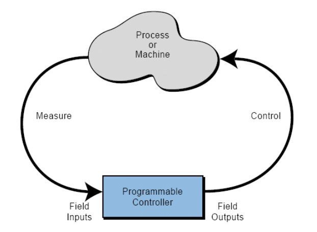

# PLC-Basic_ByDSD : Chapter-1 ความเป็นมา นิยาม และประเภทของ โปรแกรมเมเบิ้ลลอจิกคอนโทรล

## 1.1 นิยามของโปรแกรมเมเบิ้ลลอจิกคอนโทรล
PLC ก็คืออุปกรณ์ประเภทโซลิดสเตท โดยการนำ IC มาประยุกต์ใช้เป็นอุปกรณ์ควบคุม แทนอุปกรณ์จำพวก Relay หรือพวก Magnetic Contactor 

นิยาม PLC ตามมาตรฐานของ IEC 1131, PART1 คือ ระบบปฏิบัติการทางด้านดิจิตอล ออกแบบมาให้ใช้งานในอุตสาหกรรม ซึ่งใช้หน่วยความจําที่สามารถโปรแกรมได้ในการเก็บคำสั่งที่ User Program เพื่อเป็นเครื่องมือในการกําหนดฟังก์ชั่นหรือเงื่อนไขในการทำงาน เช่น การทํางานแบบลอจิก, การทํางานแบบซีเควนซ์, การใช้งานไทม์เมอร์, การใช้งานเคาน์เตอร์ และฟังก์ชั่นทางคณิตศาสตร์ เพื่อควบคุมอุปกรณ์ดิจิตอลอินพุทและเอ้าท์พุท หรือแอนะลอกอินพุทและเอ้าท์พุท ของเครื่องจักร์หรือกระบวนการผลิตต่างๆ นอกจากนั้น ทั้ง PLC และอุปกรณ์ภายนอกที่ใช้งาน จะต้องสามารถเชื่อมต่อหรือสื่อสารกับระบบควบคุมทางอุตสาหกรรม, เครื่องมือหรืออุปกรณ์ต่างๆ และใช้งานร่วมกันได้ง่าย"

## 1.2 ความเป็นมาของโปรแกรมเมเบิ้ลลอจิกคอนโทรล
แผนกไฮดรอเมติก ของบริษัท General Motor  ได้ทําการออกแบบอุปกรณ์ควบคุมชนิดหนึ่ง ขึ้นมาครั้งแรกในปี 1968 เพื่อต้องการลดต้นทุนที่สูงและขจัดความไม่ยืดหยุ่นในการนําพวกรีเลย์ โดยอุปกรณ์ที่จะนํามาแทนที่ก็คือโซลิดสเตท หรือคอมพิวเตอร์ ซึ่งมีความยืดหยุ่นมากกว่าระบบรีเลย์ แต่ต้องเป็นคอมพิวเตอร์มีคุณสมบัติพิเศษกว่าดังนี้
1. ทนทานกับสภาพแวดล้อมในอุตสาหกรรม เช่นทนความร้อน ทนการสั่นสะเทือน เป็นต้น
2. ง่ายในการเขียนโปรแกรม และสามารถนําโปรแกรมที่เขียนแล้วมาเก็บรักษาได้ง่าย เมื่อมีการเปลี่ยนตัวควบคุมชนิดใหม่นี้ จะสามารถเปลี่ยนได้ง่าย แล้วโหลดโปรแกรมที่เก็บ ไว้เข้าที่ระบบควบคุมได้เลย
3. สามารถนํามาใช้ใหม่ได้ เช่น เมื่อมีการเปลี่ยนแปลงรูปแบบการควบคุม บางครั้งจําเป็นทีจะต้องถอดอุปกรณ์ควบคุมออกมา เราสามารถนําอุปกรณ์ควบคุมนั้นไปทําการติดตั้ง ระบบควบคุมอื่น แล้วเขียนโปรแกรมใหม่เพื่อควบคุมได้
4. อุปกรณ์ควบคุมใหม่นี้ จะต้องลดเวลาการทํางานของระบบควบคุม คือควบคุมเร็วขึ้น ตอบสนองการทํางานเร็วขึ้น
5. สามารถปรับแต่ง เพิ่มเติมขนาดอินพุตหรือเอ้าท์พุตภายในอนาคตได้ จึงได้ กําหนดอุปกรณ์ควบคุมใหม่ให้มีคุณสมบัติเฉพาะดังต่อไปนี้
    * เมื่อตัวควบคุมใหม่มาใข้จะต้องมีต้นทุนโดยรวมไม่สูงกว่าระบบควบคุมที่ใช้รีเลย
    * ตัวควบคุมใหม่จะต้องมีอายุยืนยาว ทนทานต่อสภาวะแวดล้อมอุตสาหกรรม
    * ตัวควบคุมใหม่จะต้องง่ายต่อการแทนที่ด้วยอินพุตและเอ้าท์พุต
    * ตัวควบคุมใหม่สามารถส่งผ่านข้อมูลของกระบวนการควบคุมไปที่ศูนย์กลางการควบคุม